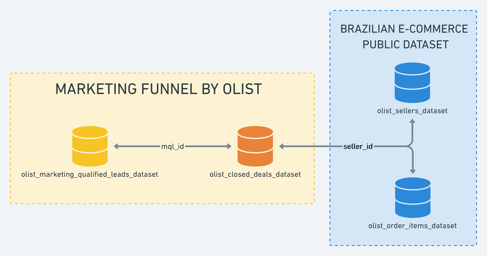

# Agentic BI Copilot

An enterprise-style Agentic Business Intelligence Copilot built on top of the Olist Brazilian E-Commerce and Marketing Funnel datasets.

The project uses:

- PostgreSQL as the analytical database
- Python data-loading scripts
- Read-only database credentials for the BI agent
- SQL views for safe business analytics
- Metadata files for table descriptions and metric definitions

---

## 1. Project structure

```text
agentic-bi-copilot/
├── data/
│   ├── raw/
│   │   ├── olist_ecommerce/
│   │   └── olist_marketing/
│   └── metadata/
│       ├── table_descriptions.yaml
│       └── metric_glossary.yaml
│
├── db/
│   ├── schema.sql
│   ├── views.sql
│   └── indexes.sql
│
├── scripts/
│   ├── load_postgres.py
│   └── create_readonly_user.py
│
├── src/
│   └── bi_copilot/
│
├── docker-compose.yml
├── Dockerfile
├── Makefile
├── pyproject.toml
├── uv.lock
├── .env.example
└── README.md
```

## 2. Environment setup

Create a local .env file from the example file:

```bash
cp .env.example .env
```

Then edit .env with your own local credentials.

Important:

```text
.env should never be committed to GitHub.
.env.example should be committed.
```

## 3. Required data files

Download the following Kaggle datasets manually:

Olist Brazilian E-Commerce Public Dataset
Olist Marketing Funnel by Olist

Place the CSV files in this structure:

```text
data/raw/
├── olist_customers_dataset.csv (From E-Commerce Public Dataset)
├── olist_orders_dataset.csv (From E-Commerce Public Dataset)
├── olist_order_items_dataset.csv (From E-Commerce Public Dataset)
├── olist_order_payments_dataset.csv (From E-Commerce Public Dataset)
├── olist_order_reviews_dataset.csv (From E-Commerce Public Dataset)
├── olist_products_dataset.csv (From E-Commerce Public Dataset)
├── olist_sellers_dataset.csv (From E-Commerce Public Dataset)
├── olist_geolocation_dataset.csv (From E-Commerce Public Dataset)
├── product_category_name_translation.csv (From E-Commerce Public Dataset)
├── olist_marketing_qualified_leads_dataset.csv (From Marketing Funnel)
└── olist_closed_deals_dataset.csv (From Marketing Funnel)
```

The raw datasets should usually not be committed to GitHub.

## 4. Database setup

Install make on your console. In Linux, run the following code:

```bash
sudo apt update
sudo apt install make
```

Then run the following code for creating the database:

```bash
make reset-db
```

## 5. Test user permissions

To test admin user permission, run the following code:

```bash
make admin-user-test
```

Listing tables, listing views, checking row counts, and testing a view should work.

To test read-only user permission, run the following code:

```bash
make read-only-user-test
```

Read query should work, while write operation should fail with a permission error.

## Dataset

It is combined by Brazilian E-Commerce Public Dataset and Marketing Funnel. The provider is Olist. The schema is shown below:


