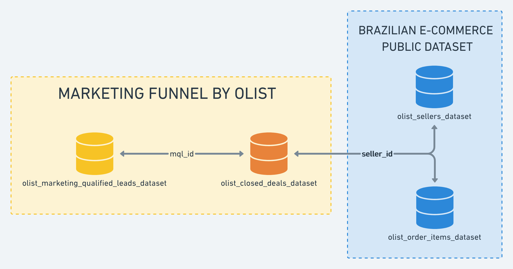

# Agentic BI Copilot

An enterprise-style governed Business Intelligence Copilot built on top of the Olist Brazilian E-Commerce and Marketing Funnel datasets.

The business problem is not just natural-language-to-SQL. The goal is to help business users get trusted, explainable answers from company data while enforcing metric definitions, SQL safety, role-aware access, and auditability.

In a real company, business teams often ask repeated ad-hoc questions such as:

- What was revenue last month?
- Which sellers are underperforming?
- Which states have delivery SLA problems?
- Which lead origins convert below benchmark?
- Can this answer be shared with an executive or external stakeholder?

Traditional dashboards are useful, but they do not always cover every follow-up question. A raw SQL chatbot is also risky because it can calculate metrics inconsistently or ignore business policy. This project explores a production-minded middle ground: an agentic BI workflow that combines structured warehouse queries with governed business context.

The intended system retrieves metadata, plans the analysis, generates read-only SQL, validates the query, executes it, verifies the answer, and returns a business-facing explanation with caveats and audit trace.

The project uses:

- PostgreSQL as the analytical database
- Python data-loading scripts
- Read-only database credentials for the BI agent
- SQL views for safe business analytics
- Metadata files for table descriptions and metric definitions
- Synthetic internal policy documents for RAG-based business context

## Business Value

This project is designed around trusted self-service analytics:

- Reduce repetitive ad-hoc analyst requests.
- Keep revenue, GMV, AOV, order count, delivery, review, and funnel metrics consistent.
- Explain not only what happened in the data, but how the company should interpret it.
- Separate numeric claims from SQL results and policy claims from retrieved documents.
- Provide traceable reasoning for business users, analysts, and reviewers.

The Olist datasets provide realistic ecommerce and marketing-funnel tables, but they do not provide a complete set of company operating-policy PDFs. To demonstrate a realistic enterprise RAG workflow, this repo includes synthetic internal demo documents under `docs/rag_sources/`.

These documents are not official Olist documents. They are generated portfolio assets that simulate the kinds of internal documents a company would use with a governed analytics copilot.

## RAG Document Sources

The RAG document set supports questions that cannot be answered by SQL alone:

- `docs/rag_sources/bi_metric_governance_handbook.pdf`: approved metric definitions, caveats, default filters, and clarification rules.
- `docs/rag_sources/ecommerce_operations_sla_policy.pdf`: delivery SLA thresholds, escalation levels, and logistics follow-up guidance.
- `docs/rag_sources/seller_performance_playbook.pdf`: seller tiering, underperformance rules, and account-manager review guidance.
- `docs/rag_sources/marketing_funnel_qualification_guide.pdf`: MQL, closed-deal, conversion-rate, SDR, SR, and lead-origin interpretation rules.
- `docs/rag_sources/data_access_and_bi_usage_policy.pdf`: role-aware SQL visibility, row-level access, exports, and audit requirements.
- `docs/rag_sources/executive_kpi_review_and_incident_playbook.pdf`: executive review structure and incident follow-up analysis.

Recommended RAG design:

- Use LangChain for the first implementation because the project already uses LangChain and LangGraph-style agents.
- Add a document retriever as a separate graph node that runs when the planner identifies policy, playbook, or metric-governance evidence needs.
- Use Chroma for a simple local portfolio demo vector store.
- Use pgvector for a more production-aligned version because the project already uses PostgreSQL.
- Keep RAG evidence separate from SQL evidence: SQL supports numeric claims, while retrieved documents support policy, benchmark, and interpretation claims.

---

## 1. Project structure

```text
agentic-bi-copilot/
├── data/
│   ├── raw/
│   │   ├── olist_ecommerce/
│   │   └── olist_marketing/
│   └── metadata/
│       ├── table_descriptions.yaml
│       └── metric_glossary.yaml
├── docs/
│   └── rag_sources/
│       ├── bi_metric_governance_handbook.pdf
│       ├── ecommerce_operations_sla_policy.pdf
│       ├── seller_performance_playbook.pdf
│       ├── marketing_funnel_qualification_guide.pdf
│       ├── data_access_and_bi_usage_policy.pdf
│       └── executive_kpi_review_and_incident_playbook.pdf
│
├── db/
│   ├── schema.sql
│   ├── views.sql
│   └── indexes.sql
│
├── scripts/
│   ├── load_postgres.py
│   └── create_readonly_user.py
│
├── src/
│   └── bi_copilot/
│
├── docker-compose.yml
├── Dockerfile
├── Makefile
├── pyproject.toml
├── uv.lock
├── .env.example
└── README.md
```

## 2. Environment setup

Create a local .env file from the example file:

```bash
cp .env.example .env
```

Then edit .env with your own local credentials.

Important:

```text
.env should never be committed to GitHub.
.env.example should be committed.
```

## 3. Required data files

Download the following Kaggle datasets manually:

Olist Brazilian E-Commerce Public Dataset
Olist Marketing Funnel by Olist

Place the CSV files in this structure:

```text
data/raw/
├── olist_customers_dataset.csv (From E-Commerce Public Dataset)
├── olist_orders_dataset.csv (From E-Commerce Public Dataset)
├── olist_order_items_dataset.csv (From E-Commerce Public Dataset)
├── olist_order_payments_dataset.csv (From E-Commerce Public Dataset)
├── olist_order_reviews_dataset.csv (From E-Commerce Public Dataset)
├── olist_products_dataset.csv (From E-Commerce Public Dataset)
├── olist_sellers_dataset.csv (From E-Commerce Public Dataset)
├── olist_geolocation_dataset.csv (From E-Commerce Public Dataset)
├── product_category_name_translation.csv (From E-Commerce Public Dataset)
├── olist_marketing_qualified_leads_dataset.csv (From Marketing Funnel)
└── olist_closed_deals_dataset.csv (From Marketing Funnel)
```

The raw datasets should usually not be committed to GitHub.

## 4. Database setup

Install make on your console. In Linux, run the following code:

```bash
sudo apt update
sudo apt install make
```

Then run the following code for creating the database:

```bash
make reset-db
```

## 5. Test user permissions

To test admin user permission, run the following code:

```bash
make admin-user-test
```

Listing tables, listing views, checking row counts, and testing a view should work.

To test read-only user permission, run the following code:

```bash
make read-only-user-test
```

Read query should work, while write operation should fail with a permission error.

## Dataset

It is combined by Brazilian E-Commerce Public Dataset and Marketing Funnel. The provider is Olist. The schema is shown below:



